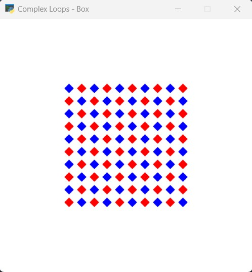

# Py-learn-assignment-13
تمرین جلسه دهم
## Python

### Session 13
<p>Start knowing arcade library.</p>
<p>Start creating a Spaceship game</p>
```
pip install arcade
```

#### use different method
```
arcade.draw_rectangle_filled()
```

