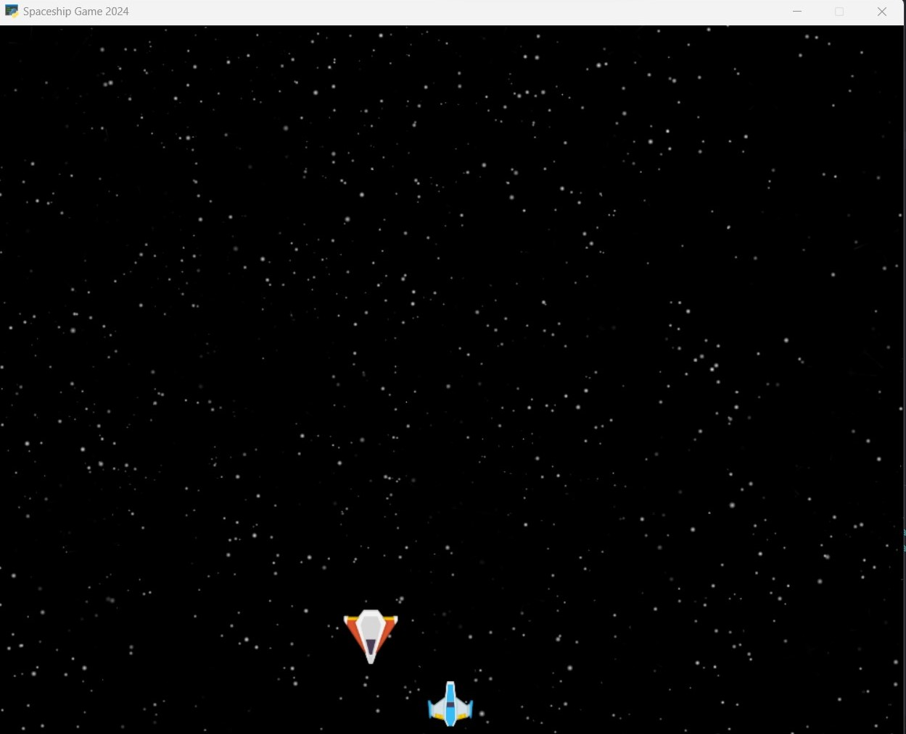

# Py-learn-assignment-13
تمرین جلسه دهم
## Python

### Session 13
<p>Start knowing arcade library.</p>
<p>Start creating a Spaceship game</p>
```
pip install arcade
```

---
## Spaceship Game
#### Run

<p>it just needs to run main.py</p>
<p> run the code below in terminal.</p>

```
python main.py
```




#### spaceship.py

<p>in this file, we have the structure for the spaceship of our, where it locate in the game window, the size of the spaceship, its name and its speed as its properties.</p>

#### enemy.py

<p>in this file like the file spaceship.py, we have the size, speed and where from its appear in the game window.</p>

#### game.py

<p>in this file, we have the basis of the game like background, planes, window size and etc
which is run in the on_draw method.</p>
<p>the method on_key_press, it handles the moving of our plane with common keys(w,a,s,d) for up, right, down and left moving.</p>
<p>the method on_update, update the things that are dynamic in the window and commit their changes like the moving of the enemy ship.</p>

---
## complex_loops
### use different method
```
arcade.draw_rectangle_filled()
```

