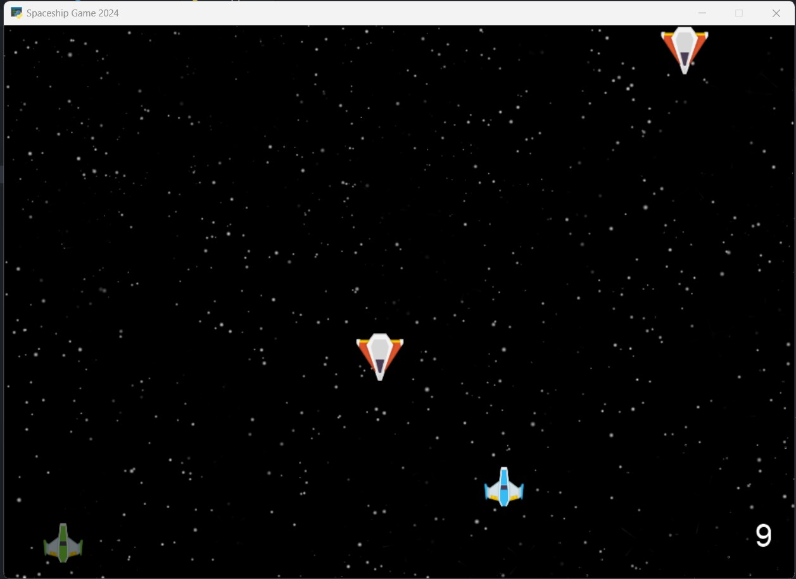
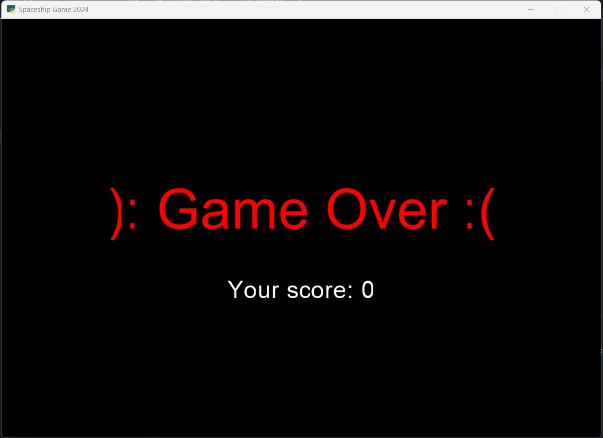

# Py-learn-assignment-14
تمرین جلسه چهاردهم
## Python

### Session 14
<p>Completing Spaceship Game</p>
```
pip install arcade
```

---
## Spaceship Game

#### Run

<p>it just needs to run main.py</p>
<p> run the code below in terminal.</p>

```
python main.py
```




#### spaceship.py

<p>in this file, we have the structure for the spaceship of our, where it locate in the game window, the size of the spaceship, its name and its speed as its properties.</p>

#### enemy.py

<p>in this file like the file spaceship.py, we have the size, speed and where from its appear in the game window.</p>
<p>after each enemy spaceship is created the speed of itself will be faster.</p>

#### game.py

<p>in this file, we have the basis of the game like background, planes, window size and etc
which is run in the on_draw method.</p>
<p>the method on_key_press, it handles the moving of our plane with common keys(a,d) for left and right moving.</p>
<p>the method on_update, update the things that are dynamic in the window and commit their changes like the moving and speed of the enemy ship, our bullets, life and score of us.</p>

##### game over

