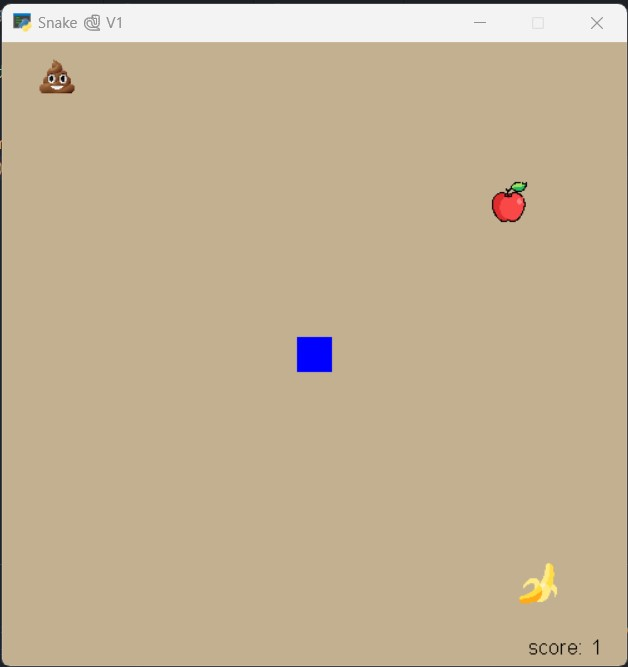
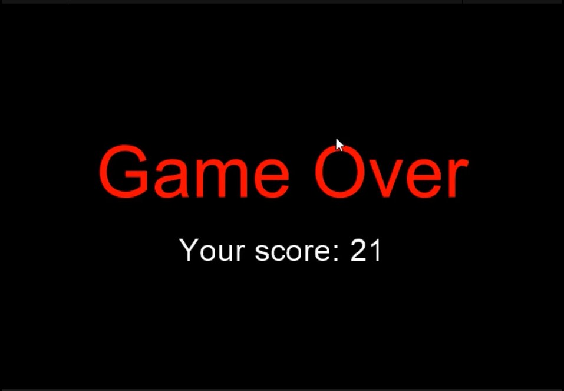

# Py-learn-assignment-15
تمرین جلسه پانزدهم
## Python-arcade

### Session 15
<p>Snake Game</p>

---

## Snake Game

### Run
<p>it just needs to run main.py</p>
<p> run the code below in terminal.</p>

```
python main.py
```



### game

<p>game starts and the snake has score 1, the head of the snake is blue, when we reach to the foods, the body of the snake grow as one of the color red or green.</p>


### apple,banana and poo

<p>when the snake eats apple, the score increase by one also the body.</p>


<p>when the snake eats banana, the score increase by two and the body increase one.</p>


<p>when the snake eats poo, the score decrease by one,but the body do not change.</p>

##### game over

<p>when the snake impacts to itself or touch the edge of the window, game is over.</p>


