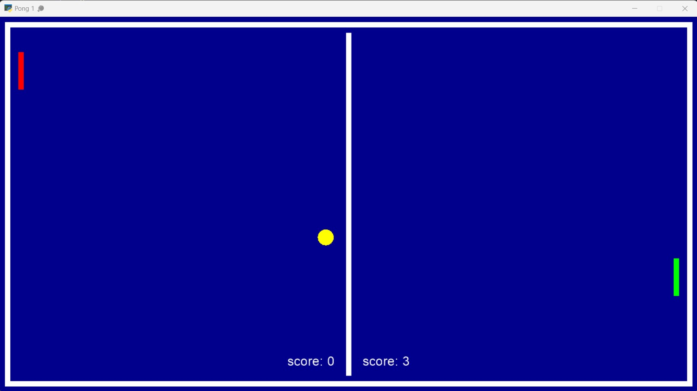
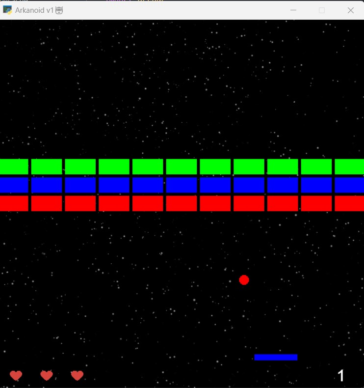

# Py-learn-assignment-16
تمرین جلسه شانزدهم
## Python-arcade

### Session 16
<p>Pong and Arkanoid Game</p>

---

## Pong Game

### Run
<p>it just needs to run main.py</p>
<p> run the code below in terminal.</p>

```
python main.py
```



### game

<p>The left raquette is controled by user's mouse and the right one has an AI to play with us.</p>


### game,ball,raquette
<p>game file, it illustrates the game window, user raquette and related things to the game.</p>

<p>The ball and raquette are drawn by arcade built-in libraries, and the ball move faster than the raquette.</p>

 ---

## Arkanoid

### Run
<p>it just needs to run main.py</p>
<p> run the code below in terminal.</p>

```
python main.py
```



### game,paddle,ball and walls

#### game

<p>game contains the game over logic, show the points and game stuff.</p>

#### paddle

<p>Paddle can move with keyboard and the mouse of user.</p>

#### ball

<p>ball is drawn by arcade built-in libraries and is slower than the paddle.</p>

#### walls

<p>it is made by arcade library like the ball and from the bottom to the top, the score increases.</p>