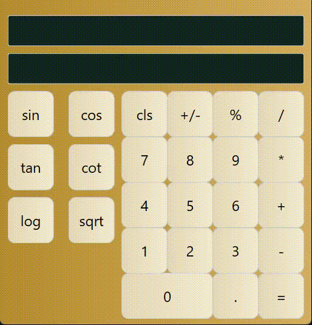

# Py-learn-assignment-17
تمرین جلسه هفتدهم
## Python-GUI(Qt)

### Session 17
<p>Calculator</p>

---

## introduction

<p>I create the calculator interface by Qt and use python as the backend code for executing the commands from the client</p>

## calculator

<p>the calculator contains the following operators which are sin, cos, cot, tan, log_10, radical(sqrt), divide, multiple, add and minus</p>

<p>the styles which sets to the <b><i>mainwindow.ui</i></b> file uses css styles that attach to the whole file</p>



### Run
<p>it just needs to run calculator.py</p>
<p> run the code below in terminal.</p>

```
python calculator.py
```