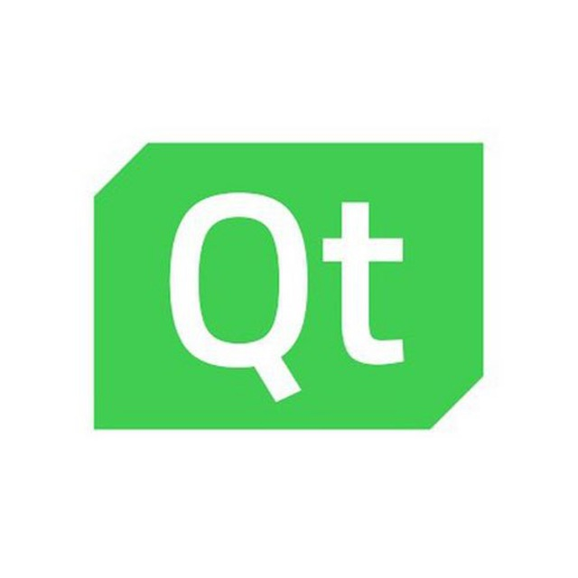
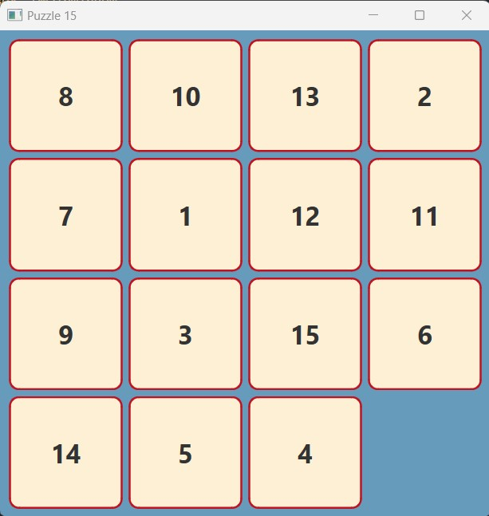
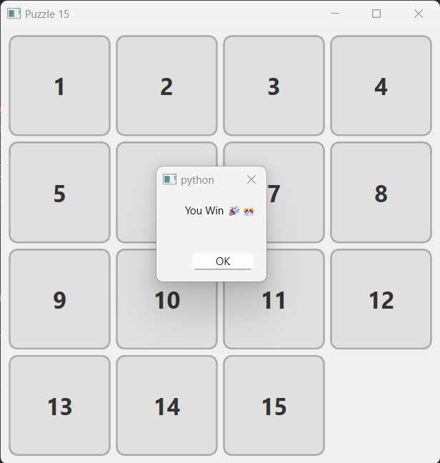
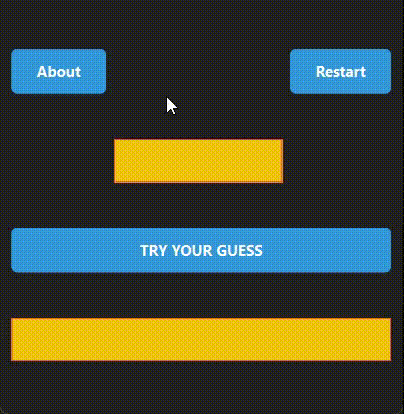
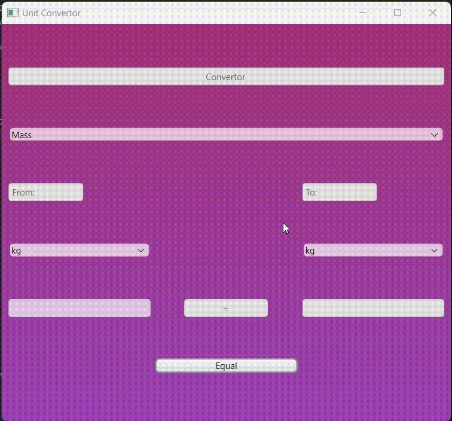
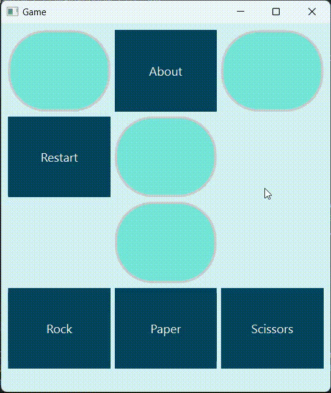

# Py-learn-assignment-19
تمرین جلسه نونزدهم
## Python-GUI(Qt)



### Session 19
<p>Contains 4 different program which are Puzzle 15, guessing number, unit convertor and the famous game rock, paper and scissors.</p>

<p>Before start introduce the programs let you know that instead of using the ui file with the suffix .ui, I use the ui_main.py file with use the buttom code in terminal for chaging the .ui file to .py file</p>


```pyside6-uic main.ui -o ui_main.py```

---

## Puzzle 15

<p>A game which the puzzles should be get in order from 1 to 15 to win.</p>




---

## guessing number

<p>A game which a number between 0 and 100 is chosen by computer and you have to find it.</p>



---

## unit convertor

<p>A unit convertor which is convert the common suffix measurment in Mass, Length, Temperature and Digital volume</p>



---

## Rock Paper Scissors

<p>A famous game which you choose between rock, paper and scissors and win!</p>

