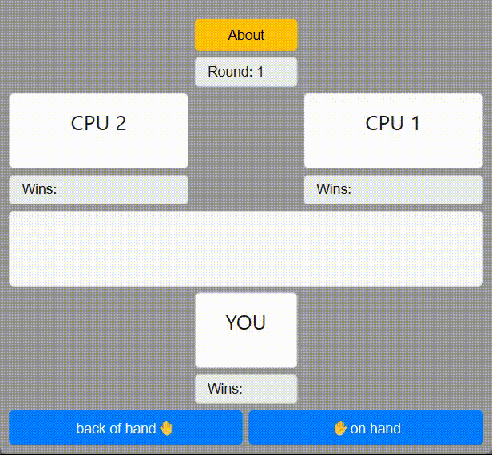

# Py-learn-assignment-20
تمرین جلسه بیستم
## Python-GUI(Qt)


### Session 20

<p>this session, we work with sqlite and start to realize the definition of database.</p>
<p>From link below you can download a sqlite database for your usage.</p>

https://sqlitebrowser.org/dl

---

#### database intro

<p>we learn about the simple queries like SELECT,UPDATE,INSERT and DELETE</p>
<p>In file Database intro, we have some sql code for queries we learned.
The file with .sql suffix is sql code and the one with .db suffix is our database.</p>

---

#### exercise

<p>it's code for working with arrays and reminder of how to work with a data that is stored.</p>

<p><b><i>symmetrical array</b></i> is a function which tells us if an array is equal to its reverse.</p>

```
print(is_symmetrical([1,3,4,3,1]))  #True
print(is_symmetrical([3,2,1]))  #False
```

<p><b><i>random marriage</b></i> is a function which provides a boy and a girl marry each other and boys or girls just have one spouse</p>

```
['(arman,mahtab)', '(sobhan,kiana)', '(kiya,minoo)', '(homan,mina)', '(sajjad,hane)', '(mohammad,faezeh)', '(abdollah,harir)', '(mahdi,fateme)']

['(sajjad,mahtab)', '(arman,minoo)', '(homan,fateme)', '(kiya,kiana)', '(abdollah,mina)', '(mahdi,faezeh)', '(sobhan,harir)', '(mohammad,hane)']

['(arman,minoo)', '(mahdi,mahtab)', '(mohammad,harir)', '(sajjad,hane)', '(kiya,kiana)', '(sobhan,fateme)', '(homan,faezeh)', '(abdollah,mina)']

['(sajjad,mahtab)', '(sobhan,fateme)', '(homan,minoo)', '(mohammad,soghra)', '(kiya,hane)', '(abdollah,harir)', '(mahdi,kiana)', '(arman,mina)']

```

<p>its the output of the code when we've ran, you see that each time different people marry each other.</p>

#### game

<p>It's a game which the game has 5 rounds without the tie rounds. who gets 3 wins, win the game. the winner of each round is the one who has different choice. <i>if two players get 2 wins and the other one get one who get one win the game.</p>

