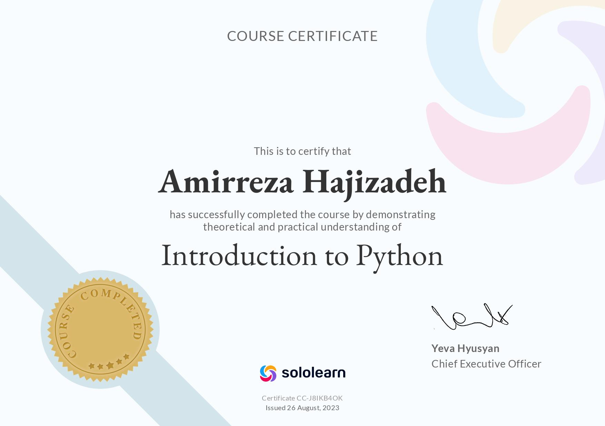

# Pylearn
practicing for being better

### Python

From Assignment 1 to 13 is Python introduction.

There is different tasks like: telegram bot, unfollower finder on instagram, QR codes, gif, managing store and some other useful examples for practicing Python programming language.

- Sololearn Python begginer certificate

- Sololearn Python intermediate certificate

#### arcade library

From Assignment 13 to ... is arcade library

